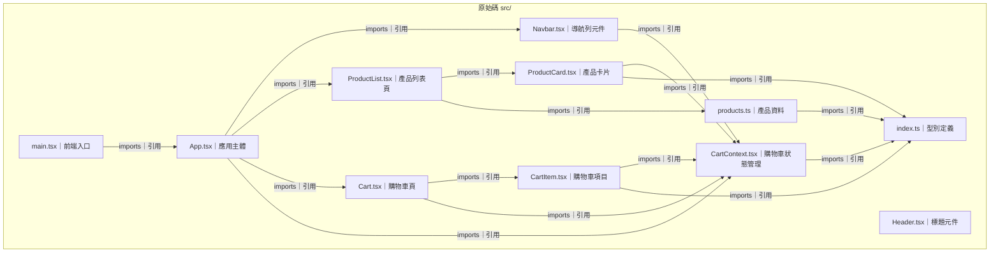

# 購物車練習專案

## 專案定位

一個以 React + TypeScript + Vite 打造的現代化購物車前端專案，適合前端學習者、React 新手與 UI/UX 練習者。  
**核心價值：**
- 完整實作購物車功能（商品瀏覽、加入/移除、數量調整、清空）
- 採用 React Context 管理全域狀態，易於擴充
- 乾淨的元件結構與型別安全
- 現代化 UI 設計，響應式支援
- 適合作為 React/Vite/TypeScript 學習範例

---

## 網站大綱（Sitemap）

- `/products`　產品列表頁
- `/cart`　購物車頁
- `/`　預設導向產品列表

> 本專案為單一語系（繁體中文），純前端 SPA，無後端 API。

---

## 環境變數

| 名稱 | 用途（中文） | 出現位置 | 是否必填 | 預設值建議 |
|------|--------------|----------|----------|------------|
| 無   | 無需環境變數 | 無       | 否       | 無         |

### `.env.example`

（本專案目前無需任何環境變數）

---

## 資料夾結構

```
src/
├─ main.tsx            # App 入口
├─ App.tsx             # 應用主體 + 路由
├─ index.css           # 全域樣式
│
├─ contexts/           # 所有 Context Provider
│  ├─ pure/            # 純 useContext
│  │  ├─ ThemeContext.tsx
│  │  ├─ UserContext.tsx
│  │  └─ LanguageContext.tsx
│  │
│  ├─ complex/         # useContext + useReducer
│  │  ├─ CartContext.tsx
│  │  └─ CountContext.tsx
│  │
│  └─ index.ts         # 可選：統一 export
│
├─ reducers/           # 純 reducer
│  ├─ cartReducer.ts
│  └─ countReducer.ts
│
├─ stores/             # Zustand / Redux Toolkit
│  ├─ useCartStore.ts
│  └─ userStore.ts
│
├─ components/         # 共用元件
│  ├─ Navbar.tsx
│  ├─ Header.tsx
│  ├─ ProductCard.tsx
│  └─ CartItem.tsx
│
├─ pages/              # 頁面元件
│  ├─ ProductList.tsx
│  └─ Cart.tsx
│
├─ types/              # 型別定義
│  └─ index.ts
│
└─ data/               # 靜態資料（mock data）
   └─ products.ts
```

### 用途說明

- `components/`：可重用 UI 元件
- [`context/`](src/context/CartContext.tsx )：React Context 狀態管理
- `data/`：靜態產品資料
- `pages/`：各頁面主體
- `types/`：TypeScript 型別

---

## 常用指令

| 指令             | 說明                   |
|------------------|------------------------|
| npm run dev      | 啟動本地開發伺服器     |
| npm run build    | 建置專案               |
| npm run preview  | 預覽建置產物           |
| npm run lint     | 程式碼靜態檢查         |

---

## 快速開始

### 安裝依賴

```sh
npm install
```

### 啟動開發伺服器

```sh
npm run dev
```

### 建置專案

```sh
npm run build
```

### 預覽建置結果

```sh
npm run preview
```

### 程式碼檢查

```sh
npm run lint
```

> 本專案無測試腳本、無 Docker 配置。

---


## API 與資料模型概觀

- **API 客戶端**：無（所有資料皆為前端靜態模擬，未串接後端）
- **資料模型**：
  - [`Product`](src/types/index.ts )：產品資訊（id, title, description, price, image, category）
  - [`CartItem`](src/types/index.ts )：購物車項目（product, quantity）
  - [`CartContextType`](src/types/index.ts )：購物車操作與狀態（addToCart, removeFromCart, updateQuantity, clearCart, getTotalItems, getTotalPrice）

---

## 部署與 CI/CD

- **部署**：可直接用 Vercel、Netlify、GitHub Pages 等靜態網站服務部署 `dist/` 目錄
- **CI/CD**：本專案未偵測到自動化部署或 CI 設定，建議可加上 GitHub Actions 進行自動建置與靜態檢查

---

## 系統架構圖

（Mermaid 流程圖，請至 [mermaid.live](https://mermaid.live) 貼上渲染）



---

## 來源索引

| 依據檔案                  | 用途說明                         | 路徑                                               |
|---------------------------|----------------------------------|----------------------------------------------------|
| [`package.json`](package.json )              | 指令、依賴、語言/框架版本        | [`package.json`](package.json )                       |
| [`tsconfig.json`](tsconfig.json )             | TypeScript 設定                  | [`tsconfig.json`](tsconfig.json )                     |
| [`vite.config.ts`](vite.config.ts )            | Vite 設定                        | [`vite.config.ts`](vite.config.ts )                   |
| [`src/App.tsx`](src/App.tsx )               | 路由定義、狀態管理 Provider      | [`src/App.tsx`](src/App.tsx )                         |
| [`src/context/CartContext.tsx`](src/context/CartContext.tsx ) | 全域狀態管理（購物車）           | [`src/context/CartContext.tsx`](src/context/CartContext.tsx ) |
| [`src/pages/ProductList.tsx`](src/pages/ProductList.tsx ) | 產品列表頁                       | [`src/pages/ProductList.tsx`](src/pages/ProductList.tsx )     |
| [`src/pages/Cart.tsx`](src/pages/Cart.tsx )        | 購物車頁                         | [`src/pages/Cart.tsx`](src/pages/Cart.tsx )           |
| [`src/data/products.ts`](src/data/products.ts )      | 模擬資料                         | [`src/data/products.ts`](src/data/products.ts )       |
| [`src/types/index.ts`](src/types/index.ts )        | 型別定義                         | [`src/types/index.ts`](src/types/index.ts )           |

系統架構圖：已由使用者提供
